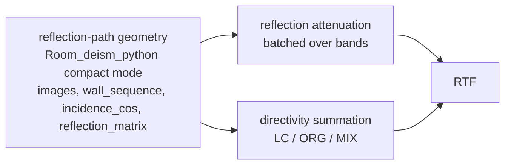

# DEISM-ARG Calculation Decoupling - Implementation Status

**Original date:** 2026-05-29
**Status updated:** 2026-05-30
**Target branch:** `deism_arg_decouple` in `DEISM_private`
**Scope:** refactor only. No new dependencies, no GPU work, and no C++ extension changes in this phase.

This document now records the implemented state of the DEISM-ARG decoupling work, including what has been done and what has intentionally not been done for each planned step.

## Current Summary

Implemented:

- `Room_deism_cpp` remains the default convex room engine for normal one-shot ARG runs.
- `Room_deism_python` is synced enough to act as the first compact geometry producer when compact mode is explicitly enabled.
- `convexCompactImages` is the canonical compact-mode flag.
- `ARG_use_compact_storage` is still accepted as a deprecated alias for one transition period.
- Compact geometry now exposes `wall_sequence` and `incidence_cos`.
- Compact attenuation is rebuilt by `_build_arg_attenuation_batch`.
- `trace_paths_from_libroom` remains as an oracle/fallback diagnostic, not the primary compact producer.
- Direct-path removal now applies one shared mask to geometry, reflection matrices, orders, compact descriptors, and attenuation.
- MIX `early_indices` and `late_indices` are computed after direct-path filtering.
- Material/frequency updates in compact mode can rebuild `atten_all` without regenerating geometry.

Not implemented in this phase:

- No C++ compact geometry producer.
- No C++ extension/API changes.
- No new runtime dependency.
- No GPU path.
- No quantified performance benchmark yet, only a reuse correctness test.
- RTF parity is wired in tests but skipped in the current `DEISM` conda env because `numba` is unavailable.
- Complex impedance parity against the C++ room path is not claimed; the comparison script reports it as unsupported/skipped because the current C++ baseline does not preserve complex parity.

## 1. What Is Separated

| Stage | Produces | Depends on | Reused while varying | Status |
|---|---|---|---|---|
| Reflection-path geometry | image positions, `wall_sequence`, `incidence_cos`, `reflection_matrix`, `orders` | room, source position, receiver position, reflection order | material, frequency, directivity, orientation | Done for compact Python ARG path |
| Reflection attenuation | `atten_all[band, image]` | compact geometry and wall impedance `Z(f)` | directivity, orientation | Done via `_build_arg_attenuation_batch` |
| Directivity summation | LC/ORG/MIX transfer-function sum | geometry, attenuation, directivity, orientation, frequency | material only if attenuation is recomputed | Existing path reused; RTF tests are skipped without `numba` |



## 2. Naming And Compatibility

| Prototype name | Current production name | Done | Not done / note |
|---|---|---:|---|
| `ARG_use_compact_storage` | `convexCompactImages` | Yes | Alias remains accepted; not removed yet |
| none | `_convex_use_compact_storage(params)` | Yes | Default remains off |
| `reconstruct_tierA` | `trace_paths_from_libroom` | Yes | Old name preserved as deprecated alias |
| `wall_seq` | `wall_sequence` | Yes | Old oracle return key preserved for compatibility |
| `cos_inc` | `incidence_cos` | Yes | Old oracle return key preserved for compatibility |
| `build_arg_attenuation` | `_build_arg_attenuation_batch` | Yes | Old wrapper preserved for compatibility |
| `get_wall_impedance` | `get_arg_wall_impedance` | Yes | Old wrapper preserved for compatibility |
| unsplit `get_ref_paths_ARG` | `get_ref_geometry_ARG` plus attenuation attachment | Yes | Public wrapper `get_ref_paths_ARG` remains |

## 3. Convex Engine Choice

| Case | Engine | Status |
|---|---|---|
| `convexCompactImages` false or unset | `Room_deism_cpp` | Done; remains default |
| `convexCompactImages` true | `Room_deism_python` | Done; used as compact producer |
| `ARG_use_compact_storage` true and canonical flag absent | `Room_deism_python` | Done; deprecated alias verified |
| Future fast compact producer | C++/libroom compact API | Not done; explicitly later work |

## 4. Step 1 - Sync `Room_deism_python` With `Room_deism_cpp`

Done:

- `Room_deism_python` now uses `params["impedance"]`; `params["acousImpend"]` is only a compatibility fallback.
- Per-wall impedance is assigned by nearest `wallCenters`, matching the C++ wrapper behavior.
- Python walls preserve `material_index`, so wall labels map back to impedance rows.
- Added `update_images(source, receiver)`.
- Added `room_engine = self` so extraction can operate on both engines.
- Python output now exposes C++-compatible `sources`, `gen_walls`, `orders`, `reflection_matrix`, and `attenuations`.
- Legacy attenuation path supports `(n_bands, N)` complex arrays.
- Python/C++ visible-image parity is verified for orders `0..4` with non-uniform per-wall real impedance.

Not done:

- Complex impedance parity against the C++ engine is not claimed. The test script probes it and reports it as skipped because the C++ path currently shows an attenuation mismatch around `1.075e-02`.
- The Python engine is not made the default one-shot engine.

Verification evidence:

- `conda run -n DEISM python tests\test_arg_room_python_cpp_compare.py`
- Orders `0..4` pass with max position error below `3e-6`, max reflection matrix error below `3e-7`, and max attenuation error around `1.2e-7` for real impedance.

## 5. Step 2 - Compact Mode In `Room_deism_python`

Done:

- `convexCompactImages=True` gates compact mode.
- Compact DFS skips impedance-dependent attenuation.
- `wall_sequence` is emitted as `int32`, shape `(N, maxReflOrder)`, padded with `-1`.
- `incidence_cos` is emitted as `float32`, shape `(N, maxReflOrder)`, padded with `NaN`.
- Incidence cosines are computed during the visibility backtrace using `abs(dot(seg / norm(seg), wall.normal))`.
- `wall_sequence` stores wall material indices, not transient local wall-list positions.
- Direct path rows have no used wall ids and are padded consistently.

Not done:

- No separate `image_sources_dfs_compact` traversal was added. The implemented path uses the existing DFS plus compact descriptor capture, which was the intended Strategy A/B path.
- No C++ compact descriptor emission.

## 6. Reflection-Attenuation Builder

Done in `deism/parallel_backends.py`:

- Added `_numba_build_arg_attenuation_batch(wall_sequence, incidence_cos, Z_S)` under the existing `NUMBA_AVAILABLE` guard.
- Reuses `_shoebox_ref_coef_from_cos_numba`.
- Added pure-Python fallback when `numba` is unavailable.
- Added `get_arg_wall_impedance(params)`.
- Added `_build_arg_attenuation_batch(params, geom)` returning `(n_bands, N)` `complex64`.
- Added validation so malformed compact geometry fails fast:
  - invalid wall/material ids,
  - wall ids below `-1`,
  - non-contiguous padding,
  - non-finite cosines on used reflections,
  - finite cosine values in padding slots,
  - cosines outside `[0, 1]`.

Not done:

- Numba runtime is not installed in the current `DEISM` conda env, so the fallback path is what executed in local verification.
- No performance benchmark numbers have been recorded yet.

## 7. ARG Extraction And Integration

Done:

- Added `_convex_use_compact_storage(params)` with default `False`.
- Added `get_ref_geometry_ARG(params, room)`.
- Kept `get_ref_paths_ARG(params, room)` as the public wrapper.
- `get_ref_paths_ARG` attaches `atten_all` from either:
  - compact reconstruction via `_build_arg_attenuation_batch`, or
  - C++/engine `attenuations` for the non-compact default path.
- Direct-path removal now uses one shared image mask for:
  - `R_sI_r_all`,
  - `reflection_matrix`,
  - `orders`,
  - `wall_sequence`,
  - `incidence_cos`,
  - `atten_all`.
- MIX `early_indices` and `late_indices` are computed after direct-path filtering.
- `core_deism.py` selects `Room_deism_python` only in compact convex mode.
- Added `DEISM.recompute_arg_attenuation()`.
- `update_freqs()` reuses cached compact geometry when possible and recomputes only `atten_all`.

Not done:

- Geometry invalidation is still controlled by the existing update flow. There is no separate geometry cache version object.
- No direct benchmarking of geometry reuse speedup has been added.

## 8. Data Contract

Current compact ARG geometry contract:

```text
R_sI_r_all         (3, N)              float32
reflection_matrix (3, 3, N)           float32
orders            (N,)                int32
wall_sequence     (N, maxReflOrder)   int32     -1 padded
incidence_cos     (N, maxReflOrder)   float32   NaN padded
Z_S / impedance    (n_walls, n_bands) complex
atten_all         (n_bands, N)        complex64
```

Done:

- Compact descriptors align with the filtered image arrays.
- `atten_all` rebuilds from descriptors within the required tolerance for tested real-impedance cases.

Not done:

- Complex C++ parity is not included in the pass criteria until the C++ baseline supports it consistently.

## 9. Verification Status

Required environment command:

```powershell
conda run -n DEISM python ...
```

Completed checks:

| Check | Status | Command / evidence |
|---|---|---|
| Python room vs C++ room, orders `0..4` | Passed | `conda run -n DEISM python tests\test_arg_room_python_cpp_compare.py` |
| Compact attenuation vs C++/libroom baseline, LC, orders `1..4` | Passed | `conda run -n DEISM python tests\test_arg_decouple.py` |
| `ifRemoveDirectPath=0` and `ifRemoveDirectPath=1` | Passed | Same decouple script |
| MIX early/late index alignment after direct-path removal | Passed | Same decouple script |
| Libroom oracle agreement with Python compact descriptors | Passed | Same decouple script |
| Deprecated alias `ARG_use_compact_storage` | Passed | Same decouple script |
| Invalid compact geometry fail-fast | Passed | Same decouple script |
| Material/frequency update reuses geometry and changes attenuation | Passed | Same decouple script |
| Targeted compile of modified files | Passed | `conda run -n DEISM python -m compileall deism\arg_decouple.py deism\arg_room_parity.py deism\core_deism.py deism\core_deism_arg.py deism\parallel_backends.py tests\test_arg_decouple.py tests\test_arg_room_python_cpp_compare.py` |

Known verification gaps:

- End-to-end RTF parity for LC/ORG/MIX is present in `tests/test_arg_decouple.py`, but skipped in the current environment because `numba` is unavailable.
- Full repo compile with `conda run -n DEISM python -m compileall -q deism tests` fails on pre-existing vendored Python-2 code:
  - `deism\libroom_src\ext\eigen\scripts\relicense.py`
  - line 55: `print 'SKIPPED', filename`
- `pytest` is not installed in the current `DEISM` env. The test files are still pytest-compatible, but the verified path is direct script execution.

Representative decouple-script results:

```text
[atten] order=1 remove_direct=0 rel_err=1.19e-07
[atten] order=2 remove_direct=0 rel_err=1.19e-07
[atten] order=3 remove_direct=0 rel_err=1.49e-07
[atten] order=4 remove_direct=0 rel_err=1.49e-07
[atten] order=3 remove_direct=1 rel_err=1.77e-07
[mix] remove_direct=0 early=7 late=57
[mix] remove_direct=1 early=6 late=57
```

## 10. Risks And Current Handling

| Risk | Current handling | Remaining work |
|---|---|---|
| `Room_deism_python` visible set diverges from C++ | Direct comparison script verifies orders `0..4` | Broaden to more geometries if needed |
| Wall ordering differs from C++ | `material_index` maps compact wall labels to impedance rows | Keep tests with non-uniform wall impedance |
| Pure Python compact producer is slower than C++ for one-shot runs | C++ remains default | Benchmark sweep payoff before changing defaults |
| MIX index alignment breaks after filtering | Indices computed after direct-path mask | Keep test coverage |
| Compact geometry malformed | Builder validates and fails fast | None for current scope |
| Complex impedance behavior differs from C++ | Explicitly reported as unsupported/skipped | Needs C++ baseline decision before claiming support |
| RTF parity not executable in current env | Tests skip when `numba` unavailable | Install/use an env with `numba` to run LC/ORG/MIX RTF parity |

## 11. Branch Step Ledger

| Step | Planned work | Done | Not done / deferred |
|---:|---|---|---|
| 1 | Preserve prototype as oracle and rename prototype API | `trace_paths_from_libroom` added; old aliases retained | Alias removal deferred |
| 2 | Rename prototype symbols to final names | `convexCompactImages`, `wall_sequence`, `incidence_cos`, `_build_arg_attenuation_batch` implemented | `ARG_use_compact_storage` not removed |
| 3 | Sync `Room_deism_python` with `Room_deism_cpp` | Done for real impedance parity, orders `0..4` | Complex C++ parity not claimed |
| 4 | Add compact mode to `Room_deism_python` | Done using existing DFS/backtrace path | No dedicated compact-only DFS |
| 5 | Add ARG attenuation builder in `parallel_backends.py` | Done, with Numba kernel and fallback | Numba not available in current env, no timing results |
| 6 | Integrate compact flag, engine selection, geometry caching, attenuation recompute | Done | No separate cache version object; no benchmark |
| 7 | Later fast production producer | Not part of this phase | C++/libroom compact exposure deferred |

## 12. Files Touched By The Implementation

Core implementation:

- `deism/core_deism_arg.py`
- `deism/core_deism.py`
- `deism/parallel_backends.py`
- `deism/arg_decouple.py`
- `deism/arg_room_parity.py`

Verification:

- `tests/test_arg_decouple.py`
- `tests/test_arg_room_python_cpp_compare.py`
