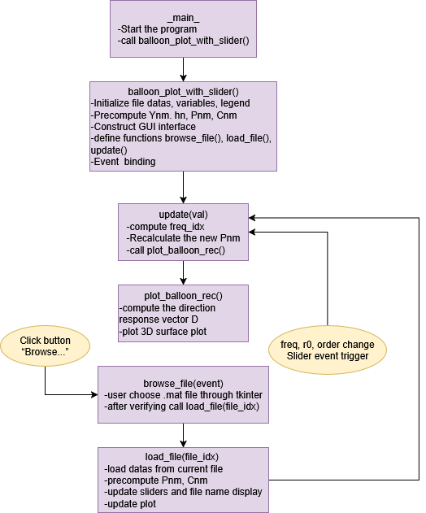
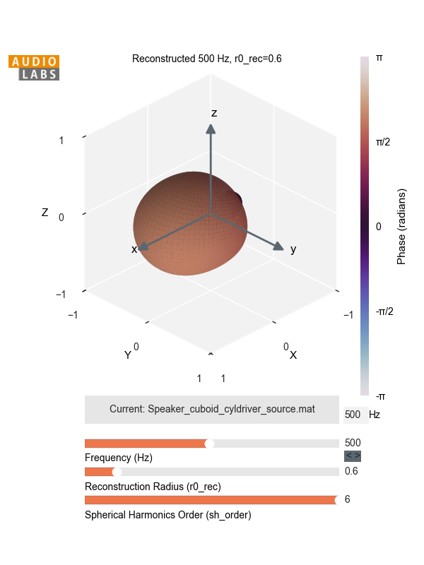

**DEISM Directivity Visualizer**

This repository is an extension module of DEISM, called "Directivity Visualize", which provides an interactive GUI to reconstruct and visualize the directivity of a sound field from a selected *_source.mat file.

It enables users to:

    Load different sound source files.

    Adjust frequency and reconstruction radius.

    Generate real-time balloon plots of the reconstructed sound field.

**Environment Setup**

Please follow the installation instructions in the DEISM repository: 
    
    https://github.com/audiolabs/DEISM
    DEISM - Preparation and Installing

We recommend using Python 3.9+.

**Run the Program**

    Download or clone this extension.(only test_check.py under ../DEISM-main/examples)

    Run the interactive interface via:
        cd DEISM-main
        python examples/test_check.py

This will launch the GUI for visualizing sound source directivity.

**Workflow**

**Example**

    Example of a directivity balloon plot at 500 Hz.

**Notes**

    This tool requires matplotlib, tkinter, scipy, numpy, and DEISM libraries.

    Input files must follow the _source.mat structure as defined in DEISM. 
    (..\DEISM-main\examples\data\sampled_directivity\source)

    You can rotate the 3D plot using the mouse. Plots update automatically as parameters are changed.

**Interpreter for SOFA data format**

    What SOFA gives

        Data.IR (M,R,N) HRIRs (time-domain), Data.SamplingRate, SourcePosition (M,3) as [az°, el°, r].

    What we need

        Psh (F,J) complex with F freqs, J=M directions,
        Dir_all (J,2) in radians as [az, inc] with inc=π/2−el,
        freqs (F,), r0.

    Pseudocode for sofa_to_internal

        function [Psh, Dir_all, freqs, r0] = sofa_to_internal(path, ear, target_freqs=None):
            ds = open_SOFA(path)
            fs = ds.Data.SamplingRate
            SP = ds.SourcePosition  # (M,3)

            az = deg2rad(SP[:,0])
            el = deg2rad(SP[:,1])
            inc = π/2 - el
            r0  = median(SP[:,2])

            IR  = ds.Data.IR[:, ear_index(ear), :]  # (M,N)
            H   = rfft(IR, axis=1)                   # (M,F)
            freqs = rfftfreq(N, 1/fs)                # (F,)
            drop DC: freqs = freqs[1:], H = H[:,1:]

            if target_freqs is not None:
                interpolate H along frequency → H_interp at target_freqs
                freqs = target_freqs
                H = H_interp

            Psh = H.T        # (F,J)
            Dir_all = stack([az, inc])
            return Psh, Dir_all, freqs, r0

**Contributors**

    B. Sc. Muyue Xi
    M. Sc. Zeyu Xu

    Feel free to open an issue or submit a pull request if you'd like to contribute or report a bug.