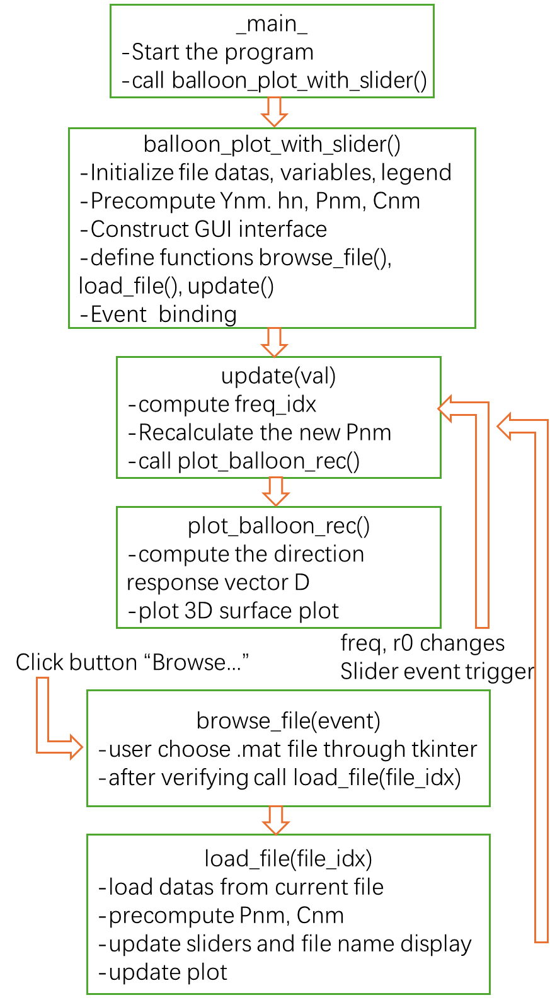

**DEISM Directivity Visualizer**

This repository is an extension module of DEISM, called "Directivity Visualize", which provides an interactive GUI to reconstruct and visualize the directivity of a sound field from a selected *_source.mat file.

It enables users to:

    Load different sound source files.

    Adjust frequency and reconstruction radius.

    Generate real-time balloon plots of the reconstructed sound field.

**Environment Setup**

Please follow the installation instructions in the DEISM repository: 
    
    https://github.com/audiolabs/DEISM
    DEISM - Preparation and Installing

We recommend using Python 3.9+.

**Run the Program**

    Download or clone this extension.(only test_check.py under ../DEISM-main/examples)

    Run the interactive interface via:
        cd DEISM-main
        python examples/test_check.py

This will launch the GUI for visualizing sound source directivity.

**Workflow**

**Example**

    Example of a directivity balloon plot at 500 Hz.

**Notes**

    This tool requires matplotlib, tkinter, scipy, numpy, and DEISM libraries.

    Input files must follow the _source.mat structure as defined in DEISM. 
    (..\DEISM-main\examples\data\sampled_directivity\source)

    You can rotate the 3D plot using the mouse. Plots update automatically as parameters are changed.

**Contributors**

    B. Sc. Muyue Xi
    M. Sc. Zeyu Xu

    Feel free to open an issue or submit a pull request if you'd like to contribute or report a bug.