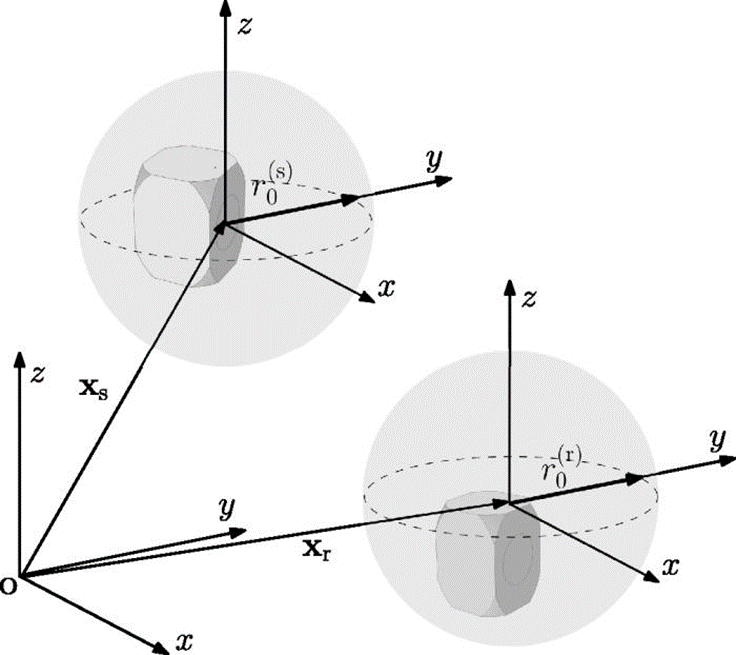

Introduction
============

Overview
--------

The Diffraction Enhanced Image Source Method (DEISM) is a Python package that solves room acoustics simulation involving source and receiver transducers with arbitrary directivity patterns. 

The package models the room transfer function between transducers mounted on one or two speakers using the image source method while incorporating local diffraction effects around the transducers.

    Overview of the DEISM method. Source and receiver transducers are mounted on speakers. The local diffraction effects around the transducers are captured using spherical-harmonic directivity coefficients. See :ref:`main-paper`.

Key Features
------------

DEISM provides the following capabilities:

1. **Arbitrary Directivities**: Support for arbitrary directivity patterns of both source and receiver transducers resulting from the local diffraction effects around the transducers and the inherent directivity of the transducers.
2. **Angle-dependent Reflection**: Angle-dependent reflection coefficients with frequency- and wall-dependent impedance definition
3. **Room Shapes**: Support for **shoebox** room shapes

In addition, DEISM-ARG (examples with arg in the names) provides the following extensions to the DEISM method:

1. **Complex Room Shapes**: Support for convex room shapes beyond simple shoebox geometries

Applications
------------

DEISM (and DEISM-ARG) is particularly useful for:

- **Smart Speaker Modeling**: Modern smart speakers with complex enclosures and directivity patterns.
- **Human Head Modeling**: Acoustic modeling involving human heads as source or listener.
- **Custom Transducer on audio devices**: Any scenario involving transducers mounted on audio devices.
- **Room Acoustics Research**: Academic and industrial research in room acoustics.

For more details on the theoretical background, see our :ref:`academic-publications`.

.. _academic-publications:

Academic publications
---------------------

If you use this package in your research, please cite the following papers:

.. _main-paper:

**Main Paper**
    Zeyu Xu, Adrian Herzog, Alexander Lodermeyer, Emanuël A. P. Habets, Albert G. Prinn; 
    "Simulating room transfer functions between transducers mounted on audio devices using a modified image source method." 
    *J. Acoust. Soc. Am.* 155 (1): 343–357 (2024). 
    `DOI: 10.1121/10.0023935 <https://doi.org/10.1121/10.0023935>`_

.. _directivity-paper:

**Directivity Formulation**
    Zeyu Xu, Adrian Herzog, Alexander Lodermeyer, Emanuël A. P. Habets, Albert G. Prinn; 
    "Acoustic reciprocity in the spherical harmonic domain: A formulation for directional sources and receivers." 
    *JASA Express Lett.* 2 (12): 124801 (2022). 
    `DOI: 10.1121/10.0016542 <https://doi.org/10.1121/10.0016542>`_

.. _iwaenc-paper:

**Arbitrary Geometries**
    Z. Xu, E.A.P. Habets and A.G. Prinn; 
    "Simulating sound fields in rooms with arbitrary geometries using the diffraction-enhanced image source method," 
    *Proc. of International Workshop on Acoustic Signal Enhancement (IWAENC)*, 2024.

Contributors
------------

- M. Sc. Zeyu Xu
- Songjiang Tan  
- M. Sc. Hasan Nazım Biçer
- Dr. Albert Prinn
- Prof. Dr. ir. Emanuël Habets 
